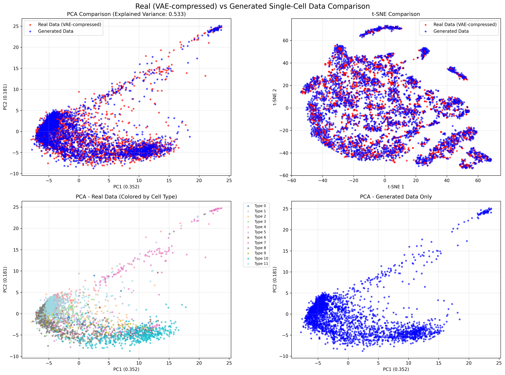

# Benchmarking Machine Learning Models for Synthesis of Omics

**Author:** Jinyuan Wang (jinyuan.wang@postgrad.manchester.ac.uk)

## Overview

This repository contains benchmarking experiments for machine learning models used in the synthesis of omics data. The goal is to evaluate and compare the performance of various generative models on single-cell genomics datasets.

## Models to be Benchmarked

The following models will be benchmarked:

- **scDiffusion** - A diffusion model for single-cell RNA sequencing data generation
- **ACTIVA** - An active learning-based method for single-cell data synthesis
- **scGAN** - A generative adversarial network approach for single-cell data generation
- **scDesign3** - A statistical framework for realistic single-cell data simulation

## Datasets

The benchmarking will be conducted on the following datasets:

1. **Human Lung Pulmonary Fibrosis** - Single-cell RNA sequencing data from human lung samples with pulmonary fibrosis
2. **Tabula Muris** - A large-scale single-cell transcriptomic database of mice across 12 organs
3. **Tabula Sapiens** - The first-draft human cell atlas of nearly 500,000 cells from 24 organs of 15 normal human subjects
4. **Waddington-OT Dataset** - A cell reprogramming dataset of mouse embryonic fibroblasts (MEFs), containing cells with different timestamps during an 18-day reprogramming process
5. **PBMC68k** - A classical scRNA-seq dataset that contains 11 different cell types of human peripheral blood mononuclear cells (PBMCs)

## Repository Structure

```
omics_analysis/
├── scdiffusion/          # scDiffusion model implementation
├── activa/               # ACTIVA model implementation
├── scgan/                # scGAN model implementation
├── scdesign3/            # scDesign3 model implementation
├── datasets/             # Dataset storage (ignored in git)
├── results/              # Benchmarking results
├── notebooks/            # Jupyter notebooks for analysis
└── utils/                # Utility functions and scripts
```

## Getting Started

1. Clone this repository
2. Install required dependencies for each model
3. Download and preprocess datasets
4. Run benchmarking experiments
5. Analyze and compare results

## Preliminary Results

### scDiffusion Unconditional Sampling

Initial results from scDiffusion model showing unconditional generation of synthetic single-cell data:


The visualization shows PCA and t-SNE projections of 3000 synthetically generated cells with 128 gene features. The PCA captures 73.4% of the variance in the first two components, while t-SNE reveals the underlying structure and diversity of the generated cell population.

### Real vs Generated Data Comparison

Comparison between real Tabula Muris data (VAE-compressed) and scDiffusion generated samples:



The comparison demonstrates that scDiffusion successfully learns the underlying data distribution:
- **Statistical similarity**: Generated data matches real data statistics (Mean: -0.0009 vs -0.0009, Std: 0.088)
- **Latent space coverage**: Generated cells occupy similar regions as real cells in the 128D VAE latent space
- **Cell type diversity**: Real data contains 12 cell types from Tabula Muris, and generated data shows comparable structural complexity
- **Quality assessment**: Both PCA and t-SNE visualizations show good mixing between real and synthetic data

## Progress Tracking

| Model | Human Lung PF | Tabula Muris | Tabula Sapiens | Waddington-OT | PBMC68k |
|-------|---------------|--------------|----------------|---------------|---------|
| scDiffusion | ⚠️ | ✅ | ❌ | ❌ | ❌ |
| ACTIVA | ❌ | ❌ | ❌ | ❌ | ❌ |
| scGAN | ❌ | ❌ | ❌ | ❌ | ❌ |
| scDesign3 | ❌ | ❌ | ❌ | ❌ | ❌ |

**Legend:**
- ✅ Completed
- ⚠️ In Progress  
- ❌ Not Started

## Status

🚧 **Work in Progress** - Models and datasets are being set up for benchmarking.

## Contact

For questions or collaborations, please contact:
- **Jinyuan Wang** - jinyuan.wang@postgrad.manchester.ac.uk